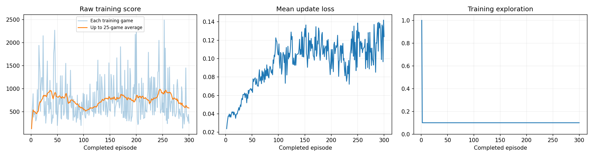
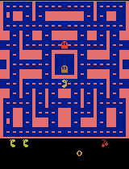
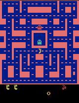

# Training a DQN agent to play Ms. Pac-Man

Class 3 assignment. A Deep Q-Network was trained on `ALE/MsPacman-v5` using the supplied classroom notebook. I chose three hyperparameters — exploration, episodes, and learning rate — ran the experiment, and evaluated the trained agent against an untrained baseline on five fixed seeds.

**Headline result:** mean evaluation score rose from **492.0** (untrained) to **772.0** (trained), a change of **+280.0** across the same five seeds. Four of the five seeds improved; one got worse.

---

## Repository contents

| File | What it is |
|---|---|
| [`pacman_dqn.ipynb`](pacman_dqn.ipynb) | The executed notebook, saved with all cell outputs from the final run |
| [`comparison.json`](comparison.json) | All five before/after evaluation scores and both means |
| [`config.json`](config.json) | Settings, hardware, and exact package versions |
| [`training.csv`](training.csv) | Per-episode training history |
| [`training_summary.json`](training_summary.json) | Decisions, learning updates, elapsed time |
| [`training_dashboard.png`](training_dashboard.png) | Score, loss, and exploration curves |
| `demos/` | Gameplay GIFs: untrained, every 25 episodes, and the best trained game |

Model checkpoints (`.pt` files) are **not** in this repository. They are large, and are kept in the local results ZIP for this run (`pacman_runs/20260913_195532_554667`).

## How to open and run

1. Open `pacman_dqn.ipynb` in Google Colab, or locally in Jupyter or VS Code with a Python 3.11–3.13 kernel.
2. In Colab, select **Runtime → Change runtime type → T4 GPU**.
3. Edit the three values in section 1 (exploration, episodes, learning rate).
4. Select **Run all**. The setup cell installs packages automatically and detects GPU or CPU.
5. Evaluation settings should be left unchanged so results stay comparable.

---

## My three hyperparameters

| Setting | Value | Why I chose it |
|---|---|---|
| Exploration | **0.10** | Exploration stays constant for the whole run rather than decaying, so 0.20 would mean one move in five is still random at the very end, capping how well the trained policy can show through. 0.10 keeps enough random moves to keep discovering new states while letting the learned behaviour dominate. |
| Episodes | **300** | Episodes are the main lever on how much the agent actually learns. The first 1,000 decisions are pure random warm-up with no learning at all, so short runs spend a large fraction of their budget not learning. 300 also triggers intermediate GIFs and checkpoints every 25 episodes. |
| Learning rate | **0.0001** | Left at the notebook default. This is the standard, well-tested value for this class of network — too large a step and the network overwrites what it has learned, too small and it barely moves. I held it fixed so the other two choices could be judged on their own. |

All other settings, including every evaluation setting, were left unchanged.

---

## What I expected, and what I observed

### Before training

I expected the trained agent to beat the untrained baseline on the mean of the five evaluation games, but by a modest margin rather than a dramatic one. 300 episodes is a short run by Atari standards, and the notebook itself warns that useful Atari learning can take much longer.

I expected any improvement to come from the agent learning to move toward pellets and keep moving rather than stalling, not from real ghost avoidance — ghost evasion requires planning several moves ahead, which a short run and a small replay memory were unlikely to produce.

I expected high variance across the five seeds, and would not have been surprised if the trained agent scored worse than baseline on at least one of them.

I also expected the training score curve to look encouraging in a way that is not trustworthy on its own. In my 5-episode setup check, scores ran 130, 460, 430, 1010, 800, which looks like steep learning but was almost entirely game-to-game randomness, since only 501 learning updates had happened. So I planned to treat the five before/after evaluation scores as the real evidence.

### After training

The mean improved by +280.0, which was a larger margin than I expected for 300 episodes. Four of five seeds improved and one, seed 4, got worse — matching my expectation that at least one seed would decline.

The prediction that held up most usefully was the one about the training curve. The 25-game running average moved between roughly 500 and 1000 with no clear upward trend, and was **falling** at the end: the recent mean was about 760 at episode 277 but 578 by episode 300. Read on its own, the training curve would suggest the agent had not learned, or was getting worse. The held-out evaluation on fixed seeds showed the opposite. Training scores are measured while 10% of moves are still random and while seeds vary game to game, so they are a much noisier signal than the fixed-seed evaluation.

Training loss also **rose** over the run, from about 0.02 to about 0.14, while play improved. This is not a contradiction: as the agent learns that some states are genuinely worth more points, the Q-values it predicts grow in magnitude, so the errors between predicted and target values grow too. Falling loss was never the goal.

Because no evaluation game hit the 3,000-decision time cap either before or after training, the improvement came from scoring more points before dying, not from surviving longer.

---

## Actual training budget

| Measure | Actual |
|---|---|
| Completed episodes | 300 of 300 (run completed, not interrupted) |
| Total decisions | approximately 181,500 |
| Learning updates | 45,126 |
| Elapsed training time | 11.7 minutes |
| Hardware | Google Colab, T4 GPU |

The run was **not** interrupted and did produce learning updates.

---

## Evaluation results

Five fixed seeds, 5% exploration, same step cap, identical before and after. The baseline is an untrained network, not a random-action agent.

| Game | Before (untrained) | After (trained) | Change |
|---|---|---|---|
| 1 | 350 | 700 | +350 |
| 2 | 500 | 570 | +70 |
| 3 | 320 | 1020 | +700 |
| 4 | 800 | 470 | −330 |
| 5 | 490 | 1100 | +610 |
| **Mean** | **492.0** | **772.0** | **+280.0** |

Time-limited games, before / after: **0 / 0**. Every game ended in a real game over rather than running out of time.

Full data: [`comparison.json`](comparison.json)

**How much this supports.** Baseline scores ranged from 320 to 800 and trained scores from 470 to 1100, so the two ranges overlap. Five games is a small sample, and the notebook states directly that five games give a small comparison rather than a reliable estimate. The honest claim is that the trained agent scored higher on average on these five seeds — not that it is 57% better at Ms. Pac-Man in general.

---

## Training dashboard

Left: raw training score per game with a 25-game running average. Middle: mean update loss. Right: training exploration, showing the drop from the random warm-up to the constant 10%.

---

## Gameplay

### Untrained (baseline, before any learning)

### Best trained game

### Progress samples every 25 episodes

Episode 25

Episode 50

Episode 75

Episode 100

Episode 125

Episode 150

Episode 175

Episode 200

Episode 225

Episode 250

Episode 275

Episode 300

All GIFs play at 4× speed and show at most the first 20 seconds of game time. The best trained GIF is selected by full-game score from the five evaluation games, so it is an illustration rather than evidence on its own.

---

## What the agent observes, does, and is rewarded for

**Observations — four game screens.** The agent sees four consecutive grayscale game screens, each shrunk to 84 × 84 pixels and stacked together as a single observation. It gets four instead of one because a single still frame cannot show movement: with four, the network can tell which way Ms. Pac-Man and the ghosts are travelling.

**Actions — joystick moves.** The agent chooses from the same set of joystick directions a human player has. Each chosen move is held for four game frames before the next decision.

**Rewards — game points.** Eating pellets, power pellets, ghosts, and fruit supplies the reward. During training these rewards are clipped to the range −1 to 1 so no single event dominates learning, while every score reported in this README is the raw game score.

The network learns by storing past experience in a replay memory, sampling batches of 32 transitions every four decisions, and adjusting its predicted value for each move toward the reward actually received plus the discounted value of what follows.

---

## One observed limitation

**Training performance was unstable and was declining by the end of the run.** The 25-game average fell from roughly 760 around episode 277 to 578 at episode 300, with no clear upward trend across the full 300 episodes. The replay memory holds only 5,000 transitions, so the agent trains on a narrow and constantly overwritten slice of recent experience and can lose behaviour it had previously learned. A run that happened to stop at a different episode could have saved a noticeably different trained network, which makes this single saved result less dependable than the +280 figure alone suggests.

## One next experiment

**Increase the number of episodes well beyond 300**, holding exploration at 0.10 and the learning rate at 0.0001 so that episodes are the only setting that changes. The full 300-episode run took only 11.7 minutes on a T4, far less than I budgeted, so a run several times longer is inexpensive. This would directly test whether the +280 improvement keeps growing with more training or whether performance has already plateaued, and would also show whether the late decline in the training average is a persistent instability or a temporary dip.
